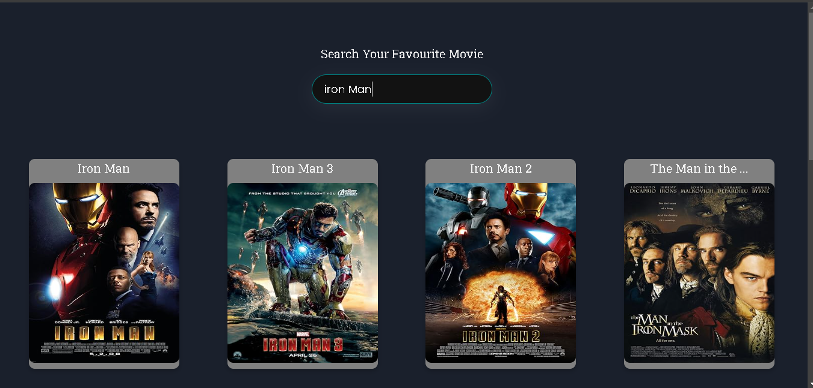
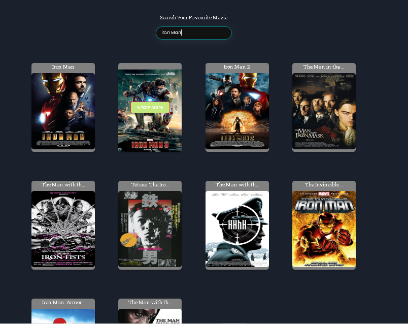
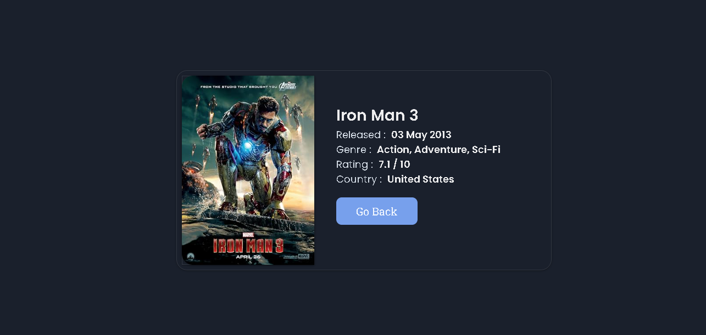

# Fluid-AI-Assignment
# 🎬 Movie Flix - Movie Search Web Application

Welcome to **Movie Flix**, your go-to web application for searching movies. This application allows users to search for movies by their name and offers filtering and sorting options to enhance the search experience. Dive into the details of your favorite movies with just a click!

## 🚀 Features

- **Search Functionality**: Find movies by entering their name.
- **IMDB API Integration**: Leverage the power of the IMDB API to fetch accurate and comprehensive movie data.
- **Filter and Sort**: Refine your search results with filtering options and sort them by name or year.
- **Detailed Movie Pages**: Click on any movie card to be redirected to a detailed page with more information about the movie.

## 🛠️ Tech Stack

- **HTML**: Structuring the content of the application.
- **CSS**: Styling the application for a visually appealing user experience.
- **React.js**: Building the dynamic and interactive user interface.
- **React Router DOM**: Managing the application's routing to navigate between pages.
- **Context API**: State management for sharing data across the application.
- **Chakra UI**: A modern UI component library for creating a responsive and accessible design.

## 📸 Screenshots

### Home Page


### Search Results


### Movie Details


## 🏁 Getting Started

Follow these steps to get a copy of the project up and running on your local machine for development and testing purposes.

### Prerequisites

Make sure you have the following installed:
- Node.js
- npm (Node Package Manager)

### Installation

1. **Clone the repository**:
   ```sh
   git clone https://github.com/bakshay96/Fluid-AI-Assignment-.git

2. **Navigate to the project directory**
    '''sh
    cd movie-flix

3. **Install the dependencies**
    '''sh
    npm install 

4. ** Run application**
    ''sh
    npm run dev

The application will be available at http://localhost:3000.
The application will be available at http://localhost:3000.

🤝 Contributing
Contributions are what make the open-source community such an amazing place to learn, inspire, and create. Any contributions you make are greatly appreciated.

Fork the Project.
Create your Feature Branch (git checkout -b feature/AmazingFeature).
Commit your Changes (git commit -m 'Add some AmazingFeature').
Push to the Branch (git push origin feature/AmazingFeature).
Open a Pull Request.
📝 License
This project is licensed under the MIT License - see the LICENSE file for details.

📬 Contact
If you have any questions or feedback, please reach out to us:

Email: bombatkarakshay11@gmail.com

GitHub: https://github.com/bakshay96/

Thank you for using Movie Flix! We hope you enjoy discovering movies as much as we enjoyed building this application.


